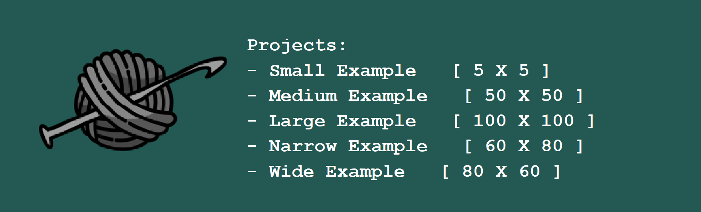

# Graphghan Pattern Creator
***

## Proposal
***

Crochet is an ancient fibre art, in which yarn is weaved into complex patterns using a hook. 
Crochet artists refer to their work as "projects", and often follow recipe-like patterns to design their work. 
This ensures that, geometrically, the stitches will form the correct shapes and be resistant to breakage. 
One of the most notorious crochet projects is the afghan, otherwise known as the throw blanket.
And of the afghans, one of the most notoriously difficult afghans to create is the graphghan, an afghan that you stitch
a pixelated pattern into. These blankets often take weeks of pre-planning, collecting materials, and then months
of crocheting to complete.

> Example Graphghan Square Pattern by E'Claire Makery --
> [Click Here](https://eclairemakery.com/wp-content/uploads/2021/09/Watermarked-Fall-Leaf-Right-Leaf-Graph.pdf)

The goal of this project is to develop an application that can assist in planning a graphghan project.
The application will open with an option to add projects or to view generated projects. 
If adding a new project, the program will prompt you to generate one on a grid-style interface. You will be able
to select the number of squares in the pattern, with length and width being independent. 
You will be able to select colors to fill the grids with. You can save this pattern to use while making your graphghan.
The program will have many tools to design your graphghan with, and will allow you to store an arbitrary
number of projects.

This project is of particular interest to me, as I spend a lot of my free time crocheting.
There is also a lot of interesting extensions I can add to my user stories, with sufficient time. Such as inputting
a JPEG image and having a graphghan pattern automatically generate, having a yarn-list for purchasing be generated,
and more. I believe this program will provide a useful
framework for future, more extensive projects. As well, many people who crochet professionally 
produce patterns as their product, and this application could be used to streamline pattern-making workflows. 

## Phase 1

#### Main Four User Stories:
* As a user, I want to be add new templates for crochet graphghan patterns to my collection of patterns by adding 
dimensions of length and width. I want to be able to give these patterns a name. 
* As a user, I want to be able to remove the projects from the collection by providing the name of the project to remove
* As a user, I want to be able to change the colours on the graphghan template, in order to design my own patterns. 
I should be able to pick multiple different colours on the same graphghan.
* As a user, I want to be able to visualize the graphghan pattern I'm designing in the console, with colours. I should
see an update to this visualization when editing the pattern, as this will confirm to me (the user) that 
my inputs are registering in the software. 

#### Additional Stories
* As a user, I want to be able to quickly see a list of all my projects currently in the program
* As a user, I should be able to see all color options while editing, to know what colors are available
* As a user, I should be able to color multiple squares by rows or columns, in order to make stripe patterns
* As a user, I should be able to fill the entire graphghan with a single color. This will make it easy 
when starting a new project to decide the background color to use 

## Phase 2

### Additional User Stories Implemented

* As a user, I want to be able to save the entire state of the crochet application
to a file. I want to be able to select to do so at any time while in the app. 
* As a user, I want to the option to load from file a previous state of the crochet
application. I want to be able to select to do so at any time while in the app. 

## Phase 3

### User Stories Implemented
* As a user, I want to add new templates for crochet graphghan patterns to my collection of patterns by adding
  dimensions of length and width. I want to be able to give these patterns a name to find them easily.
* As a user, I want to be able to remove the projects from the collection by providing the name of the project to remove
* As a user, I want to be able to change the colours on the graphghan template, in order to design my own patterns.
  I should be able to pick multiple different colours on the same graphghan.
* As a user, I want to be able to visualize the graphghan pattern I'm designing in the GUI
  * I should be able to select any of my graphghans to edit by name 
  * The GUI should update during editing to show me what changes I'm making in real-time
  * The changes I make to the blanket should persist when I close the editing window and reopen it 
  * I would like to pick any color (using RGB codes) to use on my graphghan, and I would like to be able to see what color is currently selected
  * While editing, I would like to be able to use different tools to change entire rows, columns or blankets easily 
* As a user, I want to be able to save the entire state of the crochet application
  to a file. I want to be able to select to do so at any time while in the app.
* As a user, I want the option to load from file a previous state of the crochet
  application. I want to be able to select to do so at any time while in the app.
* As a user, I want to see a display of all current projects loaded in the application. This should update as 
  I add or delete projects from the project collection.
* As a user, I want to be able to clear all projects from the project collection in a single action

### Graphical Component

### Instructions for Grader

1. How to add a new graphghan to project collection
   * When the application is running a main menu should appear on the left-hand side
   * Press the button that says `New Graphghan`
   * A pop-up window should appear asking you to enter a name, rows, and columns
     * Set `columns` to be 1 - 100
     * Set `rows` to be 1 - 100
     * Set `name` to be any string that is not empty. "Test" will work 
   * Hit `OK`
   * Your graphghan should now appear in the list under the heading `Projects`
   
   
2. How to remove a project from the project collection 
   * Make sure there is a project in the project collection to remove
     * NOTE: can follow procedure from (1) or (6) - there are preloaded projects for you to see
   * Hit `Delete Project` button
   * A pop-up window should appear asking you to select the name of the graphghan to delete
   * Use the JComboBox to select the name of the graphghan to delete
   * Hit `OK`
   * The graphghan selected to be removed from the list should now not appear under the headings `Projects`

3. How to remove all projects from project collection
    * Hit `Clear Projects` button
    * A pop-up window should appear asking you to confirm you would like to delete all projects
    * Hit `OK`
    * The projects shown under the headings `Projects` should now be empty
   

4. Where to find visual component
   * After adding a new project (1) or loading from file (6) the panel with the headings `Projects` will appear
   * A small picture below shows the visual component
     
   * Note as well these are the preloaded projects I've created for you 

5. How to save state of application
    * On the main menu press `Save`
    * A pop-up window will appear asking you to confirm the save
    * Hit `OK`
    * Your data will now be saved to the JSON file 
 
  
6. How to load state 
   * On the main menu hit `Load`
   * A pop-up window will appear asking you to confirm the load
   * Hit `OK`
   * Your data will now be loaded, and the loaded data should be reflected in the app

7. How to edit a graphghan 
   * Make sure you have at least one project in the project collection
   * On the main menu hit `Edit Project`
   * A window such as the one below will open for the selected graphghan
   
   * The top row is the tool panel
     * `One Square` will change the color of the square pressed
     * `Fill` will change the color of the entire graphghan
     * `Fill Column` will change the color of the entire column selected
     * `Fill Row` will change the color of the entire row selected
     * The colored bar shows your current color
     * `Change Color` will prompt the user through a changing color process
   * You can begin editing by clicking on the squares you'd like to change the color of
   * You can tell which tool is selected as it will be colored a light-teal color
   * Closing the window will dispose of the editing window and re-display the projects
     panel, but will save the changes you made to the graphghan
     * See this quickly by closing and re-opening a project you've edited 